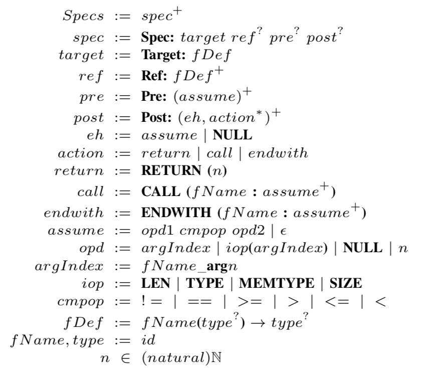
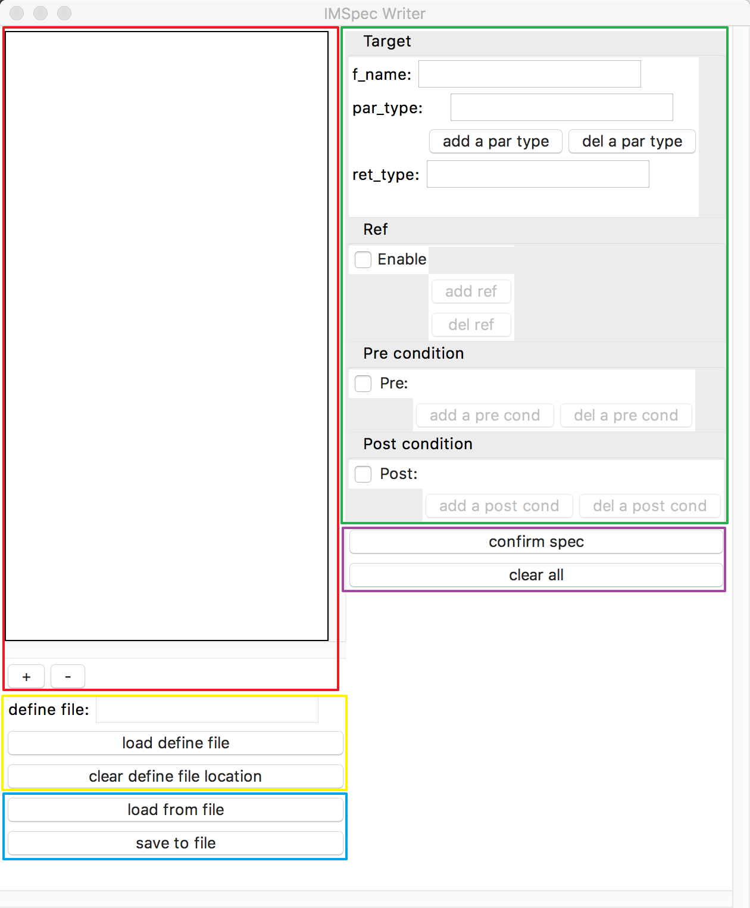

# Usage of IMChecker Toolkit

Our tools depends on:

1. [clang-3.9](http://releases.llvm.org/3.9.0/)
2. java8
3. python3 & python2.7

IMChecker is still under development, and contains a lot of bugs and TODO lists. Any bugs or feature requests, feel free to email us at guzx17@mails.tsinghua.edu.cn or open issues.

### Brief usage

We have upload a demonstration at https://youtu.be/YGDxeyOEVIM

Basically, usage of our tool consists of three steps:

1. create the API usage specification

   ```shell
   [~/IMChecker/tools]$python3 imspec_writer.py
   ```

   The usage of IMSpec Writer client can be found below.

   Users also can write the specification from scratch according to the syntax of IMSpec.

2. run the analysis engine

   ```shell
   [~/IMChecker/tools]$python3 engine.py --spec=spec.yaml --specDefine=define.h --input=example_code/[example.ll | example.c]
   ```

   * -- spec: is the specification location
   * --specDefine: is the macros definition file. If no macros, it can be omitted.
   * --input: is the target analysis file 

   Currently, we accept a compilable C file or LLVM-IR file. To generate IR file, run the command (**-g is used to generate debug information for report_displayer**)

   ```shell
   [~/IMChecker/tools/example_code]$clang-3.9 -S -emit-llvm -g example.c
   ```

   For projects with a Makefile, we provide a build-capture tools to help users generate LLVM-IR files. See the build-capture part for details.

3. audit the result

   ```shell
   [~/IMChecker/tools]$python3 report_displayer.py
   ```

### IMSpec Writer

#### What is it

This is a graphical user interface (GUI) for user to write IMSpec. For information of IMSpec, please refer to IMChecker.

#### How to use it

Prerequisites

* python3-tk

  ```
  sudo apt-get install python3-tk
  ```

* python3

  * pyyaml

    ```shell
    pip install pyyaml
    ```

Run

After you satisfy the prerequisites, simply run:

```shell
python imspec_writer.py
```

#### User menu

IMSpec syntax

Here is the abstract syntax of IMSpec, for detailed information, please refer to IMChecker Paper.



Main window

The main window is as shown below:



The main window consists of several parts:

* short spec display box (red rectangle): used to display short version of spec string (introduced below)
* define loading button (yellow rectangle): used to load define file
* file saving or loading (blue rectangle): used to save to or load from file
* spec writing area (green rectangle): used to write spec
* confirm or clear (purple rectangle): used to confirm spec or clear all fields

#### How to write a spec

We will mainly introduce how to write a spec using IMSpec Writer.

1. `Target` field

   `Target` is a 'must' in IMSpec, it is a `fDef`, which consists of a `fName`, a list of `type` denoting parameters' types (`par_type`) and a `type` denoting return value type (`ret_type`). User must fill in all these fields in the `Target` area.

   User can input `_` in any `type` fields meaning that "this type is not concerned".

   In `par_type` area, user can click "add/del a par type" button to add/delete a `par_type` field.

2. `Ref` field

   `Ref` is **not** a 'must' in IMSpec, it is a set of `fDef`. Functions defined in `Ref` field must be appeared in `Post`. After the `Enable` checkbox is checked, user can click the `add ref` button to add a `fDef` frame, where user can enter the `Ref` field. User can also delete a ref fDef frame by clicking the `del ref` button.

3. `Pre` field

   `Pre` is **not** a 'must' in IMSpec, it is a set of `assume`. `assume` is a denoted by `opd1 cmpop opd2`, where `opd` means operand and `cmpop` means comparative operator. For detailed information about `assume` please refer to IMChecker paper. `Pre` field contains 0 or multiple `assume` instances. User can easily add or delete `pre` condition by clicking `add a pre cond` or `del a pre cond` button after the `Pre` checkbox is checked.

4. `Post` field

   `Post` is **not** a 'must' in IMSpec, it is a set of tuples (`eh`,`action∗`). `eh` means error handling condition, it is an `assume`, or `None` for no-condition. `action` is a `return` or a `call` or a `endwith`. For detailed information about `action` please refer to IMChecker paper.

When user done writing a spec instance, simply clicks the `confirm spec` button, the spec instance will be added to the memory and a short version of this spec instance will be displayed in the display box (the red rectangle). If the user wants to discard the unsaved spec instance, simply clicks the `clear all` button, then the whole spec writing area will be re-constructed.

User can delete a saved spec instance by clicking the `-` button under the short spec display box after selecting a spec instance in the display box.

#### Define file

Like Linux or other large projects, developers may use macros to denote error number or other meaningful output, IMSpec Writer accepts these macros as inputs as long as user load a `define file`. A define file is completely same as a `c` macro format file as follow:

```c
#define	EPERM		 1	/* Operation not permitted */
#define	ENOENT		 2	/* No such file or directory */
#define	ESRCH		 3	/* No such process */
#define	EINTR		 4	/* Interrupted system call */
#define	EIO			 5	/* I/O error */
#define	ENXIO		 6	/* No such device or address */
#define	E2BIG		 7	/* Argument list too long */
#define	ENOEXEC		 8	/* Exec format error */
#define	EBADF		 9	/* Bad file number */
#define	ECHILD		10	/* No child processes */
```

Simply click the `load define file` button and choose the define file. Or click the `clear define file location` button to clear the define file path.

#### Save-to/Load-from file

User can save the spec instances saved in memory (that is, all spec instances shown in display box) in `.yaml` format. Simply click the `save to file` button and select a destination will do the job.

User can also load spec from a previously-defined spec instance file by clicking the `load from file` button and select the file.

#### Write from scratch

Users also can write the spec from scratch according to the syntax of IMSpec referring the in `imspec` folder.

### Result Displayer

As shown below, we provde a displayer to help users audit the analysis results.


### Build Capture

Build capture tool is designed for capturing the build process of a Makefile project. Basically, it will save all the single lines of $CC$ and re-make the project to produce all the intermediate results.

That is, we can produce all the *.i files, which is a self-contained preprocessed files. Then for each *.i files, we can generate the LLVM-IR files clang. For example, 

```shell
[~/IMChecker/tools/example_code]$gcc -E example.c -o exmaple.i
[~/IMChecker/tools/example_code]$clang-3.9 -S -emit-llvm -g example.i
```

We have provide part of build-capture result of Openssl-1.1.1-pre8 in `build-cpature` folders.

In theory, any projects supported by clang can be build-capture by our tool. However, clang is different from gcc. Therefore, we suggest to replace the $CC$ in Makefile by clang-3.9, such as

```makefile
CROSS_COMPILE=
CC=$(CROSS_COMPILE)clang
```

In this way, all the *.i files can be compiled by clang to generate LLVM-IR files. 

For multiple LLVM-IR files, use the following command to combine them and use as our tool,

```shell
llvm-link a.ll b.ll -o output.bc
llvm-dis output.bc -o input4engine.ll
```

Unfortunately, build-capture tool is under the patient application process. Therefore, we cannot provide the tool here.

But, it can be available for academic use only by emailing us guzx17@mails.tsinghua.edu.cn